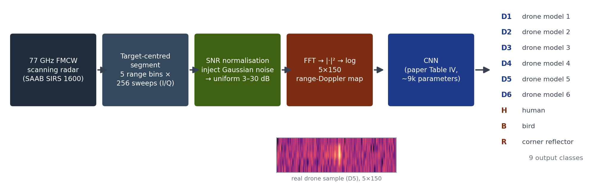
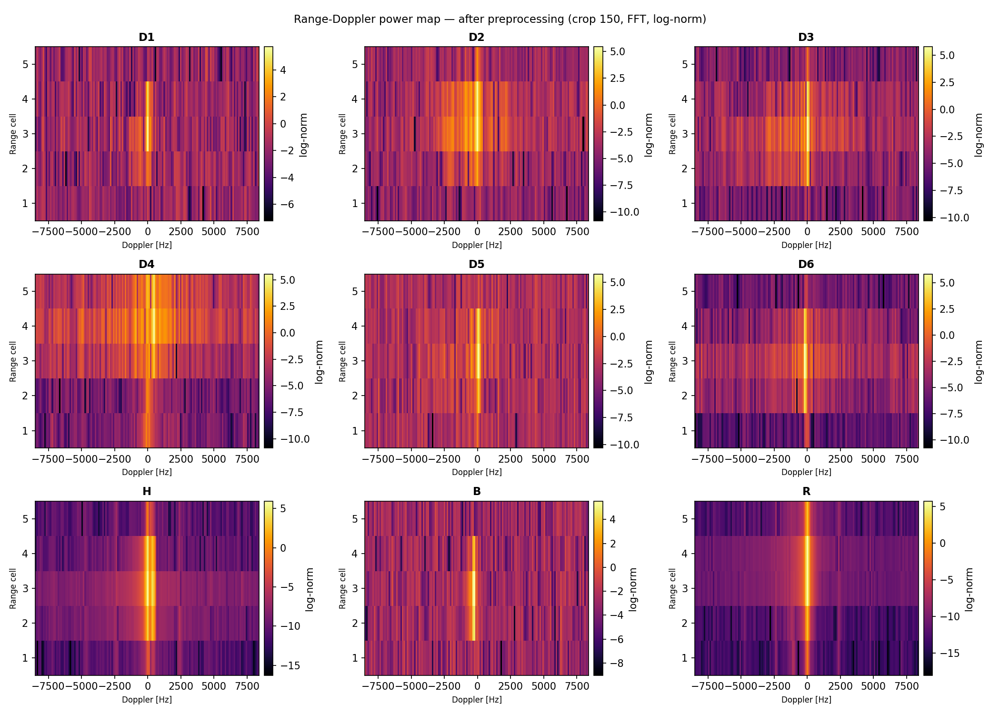
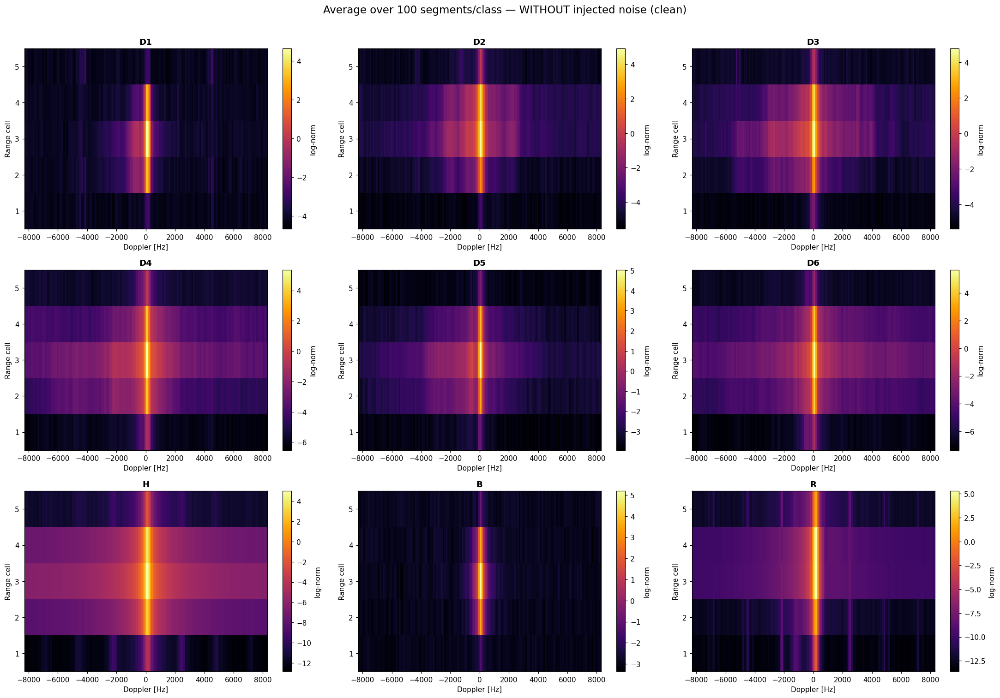
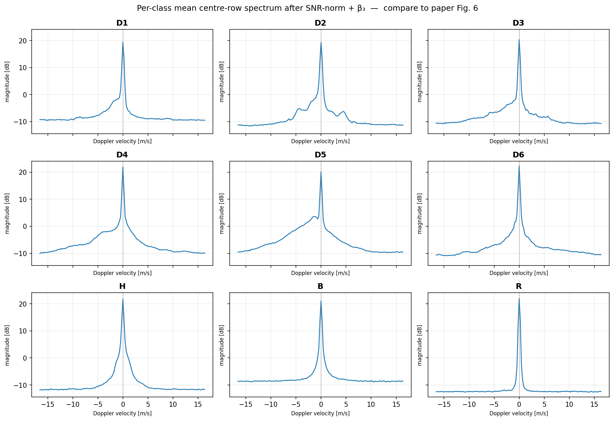
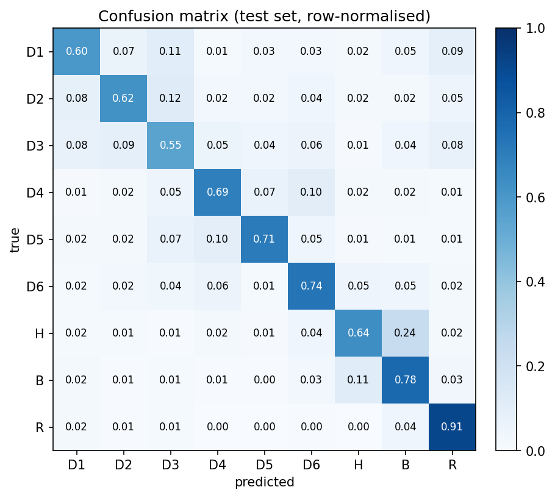

<div align="center">

# 🛰️ FMCW Radar: 9-Class Target Classification

### Reproducing an IEEE drone-classification benchmark from raw 77 GHz radar, with **no synthetic data**

<br>

<table>
<tr>
<td align="center"><h2>69%</h2><sub>mean test accuracy<br>(paper: 68%)</sub></td>
<td align="center"><h2>9</h2><sub>classes: 6 drones,<br>human · bird · reflector</sub></td>
<td align="center"><h2>75,868</h2><sub>real radar segments<br>0 synthetic</sub></td>
<td align="center"><h2>3–30 dB</h2><sub>uniform SNR<br>normalisation</sub></td>
</tr>
</table>

</div>

## Project overview

To a radar, a small drone and a bird can look almost identical: comparable size, speed, and a quite similar radar cross-section, so echo strength alone cannot separate them. A feature that does give the drone away is the motion *inside* the returned echo: spinning rotors imprint a micro-Doppler signature that flapping wings don't replicate. The catch is that a scanning surveillance radar sweeps past each target in milliseconds; at the **9 ms dwell time** here, that signature is far weaker than in most published studies. And the question is no longer academic: with small drones now a battlefield threat and a growing risk around airports, compact tactical radars must decide from a fleeting, noisy echo whether to raise an alarm.

**This project reproduces a published IEEE drone-classification benchmark end-to-end, from 75,868 raw recordings of a 77 GHz FMCW surveillance radar (six drone models, birds, humans, a calibration reflector) to a compact CNN (~9k parameters) classifying 5×150 range-Doppler maps, using no synthetic data.** Bottom line: **91% accuracy on the operational question of drone or not**, and 69% on the full 9-class identification, matching the paper.

<div align="center">

</div>

### The 9 classes

| Label | Target | Label | Target |
|---|---|---|---|
| **D1–D6** | six different drone models (anonymised in the dataset) | **B** | birds (gulls, pigeon, raven, heron) |
| **H** | human, walking or running | **R** | static corner reflector (calibration target, no moving parts) |

---

## ① Network input

*One raw sample per class, after preprocessing (crop 150 → FFT → log-norm). This is the input to the network: a 5×150 Range-Doppler image.*

<div align="center">

</div>

## ② Class fingerprints: average over 100 segments (before noise injection)

*Average of 100 raw segments per class. Averaging suppresses the random speckle (its fluctuation falls as ~1/√M, ≈10% at M=100), so each class's stable spectral signature emerges: the micro-Doppler skirts of the drones, the broad bulk-Doppler lobe of H, and the razor-thin return of R. These recurring shapes are what make the classes separable. Averaging smooths the noise floor but does not remove it, and note the network itself sees single, noisy frames, not this average.*

<div align="center">

</div>

## ③ The Doppler spectrum signature of each class

*This is a **1-D slice** of the maps above: for each class we take the centre range row, convert to magnitude in dB, and average over many segments. The x-axis is Doppler velocity (target motion), the y-axis is signal strength. Reading it: the tall central peak is the target's **bulk motion** (body moving toward/away from the radar); the wider **shoulders** on either side are **micro-Doppler**, energy from smaller moving parts, i.e. spinning drone rotors. Drones (D1–D6) therefore show broad, structured shoulders; a human (H) shows a narrower spread from limbs; a bird (B) and the static corner reflector (R) collapse to a sharp, near-symmetric peak with almost no shoulders. These distinct shapes, not the signal strength, are what the CNN learns to tell apart. The curves also match the corresponding figure in the source paper, which validates the whole preprocessing chain (crop → SNR-norm → β₃ → FFT → log).*

<div align="center">

</div>

## ④ The result

*CNN test-set confusion matrix (row-normalised). Diagonal = per-class recall. R (corner reflector) is near-perfect; D3 is the hardest drone; H↔B is the dominant confusion, exactly the structure the paper reports.*

<div align="center">

</div>

---

Reproduction of the 9-class benchmark (six drones, humans, birds, corner reflectors, **no synthetic-drone class**) from:

> A. Karlsson, M. Jansson, M. Hämäläinen, *"Model-Aided Drone Classification Using Convolutional Neural Networks"*, IEEE Radar Conference, 2022. [IEEE Xplore](https://ieeexplore.ieee.org/document/9764194)

Data: SAAB SIRS 1600 77 GHz FMCW scanning radar, 9 ms dwell time.
Dataset published by the authors: [doi:10.5281/zenodo.5845259](https://doi.org/10.5281/zenodo.5845259) (not included in this repo).

**Result: mean test accuracy 0.69 vs 0.68 reported in the paper (Fig. 3), with per-class recalls matching within a few points.** See [Results](#results) and the [SNR-shortcut experiment](#the-snr-shortcut-experiment), a finding beyond the paper.

---

## Repository layout

```
fmcw/
├── data_loading.py           # raw .npy (130 recordings) → segments.npz (75 868 segments)
├── preprocessing.py          # segment (5×256 complex) → log-normalised Range-Doppler map (5×150)
│                             #   crop → SNR normalisation → β₃ bulk-Doppler centering → FFT → |·|² → log-norm
├── snr_norm.py               # SNR estimation + noise injection (single source of truth, see Methodology)
├── prepare_snr_dataset.py    # bakes the SNR-normalised train/val/test set (paper Section II counts)
├── dataset.py                # PyTorch Dataset + loaders, non-drone class balancing (paper Section III)
├── model.py                  # CNN, exactly paper Table IV (8782 + Nc·33 parameters)
├── train.py                  # 10 networks × 25 epochs, Adam; best validation network kept
├── evaluate.py               # test accuracy, per-class recall, confusion matrix
├── plot_doppler_spectrum_signatures.py  # per-class mean Doppler spectrum (validates preprocessing vs paper)
└── 0_prepare.sh 1_train.sh 2_evaluate.sh run_all.sh
```

## How to run

```bash
python -m venv .venv && source .venv/bin/activate
pip install -r requirements.txt

# place data_SAAB_SIRS_77GHz_FMCW.npy in the repo root (see Zenodo link above), then:
./run_all.sh          # = 0_prepare.sh → 1_train.sh → 2_evaluate.sh
```

Outputs: `models/best_model.pt`, `results/confusion_matrix.{csv,png}`, `results/history.csv`, training curves and figures under `results/figures/`.

---

## Methodology: reconstructing the unspecified SNR normalisation

The paper normalises every sample to a **uniform SNR distribution of 3–30 dB** by adding complex Gaussian noise ("SNR at the centre of s₃, after range compression"). It does **not** specify how SNR is measured; the authors, having built the radar, presumably knew its calibrated noise floor. Reconstructing this step is the core difficulty of the reproduction.

### 1. Noise-floor estimation (`snr_norm.py`)

Per-sample noise floors estimated from in-beam data are class-dependent (drone micro-Doppler smears energy across bins). Instead, a **single shared floor σ²** is pooled from the far edges of the full 256-sample azimuth sweep (±2° from beam centre, all 5 range rows), across all classes **except R**, whose huge return (RCS ≈ 100 m²) leaks into its own edges. A low percentile (p10, exponential-corrected: σ² = p10 / −ln 0.9) is used because leakage only ever pushes edge power *up*. The low quantiles of the pooled edge powers match the exponential distribution expected of complex Gaussian noise to within a few percent, supporting both the Gaussian noise model and the single-constant floor. Signal power is the mean over a 7-column window at the beam peak of the centre range row, matching the paper's "SNR at the centre of s₃". Injected noise is sized directly from this floor: `add_var = σ²·(g_cur/g_t − 1)`.

### 2. Strict target-first sampling (`prepare_snr_dataset.py`, `SNR_STRICT = True`)

A naive implementation (draw sample, draw target, skip if target ≥ estimated SNR) leaves ~25% of samples untouched; their labels are then only as good as the floor estimate, and the realised distribution is not uniform (deficit above ~21 dB). Instead we draw the **target first** (exactly Uniform 3–30 dB), then pick a sample whose estimated SNR is ≥ target + 3 dB and noise it down. Because the injected noise (known exactly) dominates the uncertain original floor, a small floor-estimation error of ε dB perturbs the final label by only ≈ ε·10^(−m/10) to first order: the 3 dB margin roughly halves small floor errors (the linearisation is accurate at the ~1 dB scale of the residuals measured here). Samples below 6 dB estimated SNR are excluded (no add-noise scheme can label them reliably); exclusions are counted per class in the build log (concentrated in birds, ~8.6–9.8% of the B pool per split; ≤1.4% in every other class). Realised distribution: every class at mean 16.5 dB, std 7.8 dB, the theoretical values for Uniform(3, 30), with zero fallbacks.

### Known residuals (documented, not hidden)

- B's own-edge floor estimate sits ~1.2 dB below the pooled constant. Since leakage can only inflate edge estimates, the lower reading is closer to the true floor, i.e. B labels are conservative by up to ~0.6 dB after margin attenuation.
- R's edges carry residual self-leakage of ~6–14 dB depending on range (14.2 dB nearest quartile → 6.2 dB farthest, ~9.2 dB pooled); the range dependence indicates leakage rather than a genuinely different noise floor, so the shared floor (computed without R) is applied to R regardless.
- `edge_flag == 1` segments (synthetic FOV-edge padding, 67 of 75 868) are dropped; the paper does not mention them.

---

## Results

Test set: 4000 samples/class × 9 classes, uniform 3–30 dB. Training protocol matches the paper: 10 networks × 25 epochs, Adam (β₁=0.9, β₂=0.999, ε=1e−8, lr=0.001), batch 128, He init, best-validation network selected, non-drone classes duplicated to balance drone/non-drone totals (120 000 training samples).

| Class | Paper (Fig. 3) | This repo | Δ |
|---|---|---|---|
| D1 | 0.62 | 0.60 | −0.02 |
| D2 | 0.60 | 0.62 | +0.02 |
| D3 | 0.48 | 0.55 | +0.07 |
| D4 | 0.68 | 0.69 | +0.01 |
| D5 | 0.73 | 0.71 | −0.02 |
| D6 | 0.69 | 0.74 | +0.05 |
| H  | 0.71 | 0.64 | −0.07 |
| B  | 0.69 | 0.78 | +0.09 |
| R  | 0.93 | 0.91 | −0.02 |
| **mean** | **0.68** | **0.69** | **+0.01** |

The structure matches the paper: D3 is the weakest drone, R near-perfect, H↔B the dominant confusion pair. The one qualitative deviation, our H < B where the paper has H > B, is analysed below; it is a *consequence of removing a shortcut*, not a pipeline defect.

### Drone vs non-drone: the metric that matters operationally

The 9-class accuracy understates the system's practical value: most errors are drone↔drone confusions (which *model* of drone), which are operationally irrelevant. Collapsing the confusion matrix to the binary question, *is it a drone at all?*, gives:

| | Drones classified as drone | Non-drones classified as non-drone |
| --- | --- | --- |
| Paper (Section IV, Nc = 9) | 0.88 | 0.93 |
| This repo | **0.90** | **0.93** |

Overall binary accuracy **0.91**; only 7% of birds/humans/reflectors are falsely flagged as drones.

---

## The SNR-shortcut experiment

**Question.** The paper's normalisation exists so that classification is "based on the shape of the spectrum alone", not on SNR. Birds, however, are physically weak targets; many bird samples cannot reach the 3–30 dB band by *adding* noise. The paper does not say how this is handled. Does the handling change what the network learns?

**Setup.** Two datasets, identical except for the noise policy:

- **Loose**: samples whose estimated SNR is below the drawn target are kept unchanged. Result: per-class SNR distributions differ (B averages 10.9 dB, H averages 16.4 dB). *Noise level correlates with class.*
- **Strict**: target-first sampling (above). Every class has an identical uniform 3–30 dB distribution. *Noise level carries zero class information.*

One model trained on each, then **cross-evaluated** on the other's test set:

| | own test (H / B) | cross test (H / B) |
|---|---|---|
| Loose model | 0.79 / 0.74 | 0.81 / **0.52** (B→H = 0.39) |
| Strict model | 0.64 / 0.78 | 0.63 / 0.72 |

**Reading.** The loose model's bird recall collapses by 22 points on strict data: it had learned "noisy spectrum → bird", a real pattern in its training set, and misclassifies the clean, high-SNR birds it never saw as humans. The strict model transfers essentially unchanged in both classes. Both directions are needed: the collapse alone could be generic distribution shift, but the strict model faces the same shift and pays nothing, so the defect is localised to what the loose model learned, not to the act of cross-testing.

**Implications.** (1) The loose model's paper-like H > B ordering was partly propped up by the noise-level shortcut, exactly the bias the paper's normalisation is meant to eliminate. (2) The strict model's H 0.64 / B 0.78 is the honest shape-only performance; at 9 ms dwell both classes are essentially a bulk Doppler line with weak modulation, and the boundary region is genuinely large. (3) Since the paper leaves the low-SNR-bird handling unspecified, its reported H/B split may contain the same confound. The unspecified detail is not a detail: it changes what the classifier learns.

---

## Reproducibility notes

- All randomness is seeded (`prepare_snr_dataset.py --seed`, `SEED` in `config.py`); dataset generation is deterministic.
- `SNR_STRICT = False` in `prepare_snr_dataset.py` reproduces the loose policy for the cross-evaluation experiment.
- Run-to-run test accuracy varies by ±1–2 points even with best-of-10 selection; per-class H/B ordering under the strict policy is stable across runs.
- The paper PDF is not distributed here (IEEE copyright); see the citation above.
